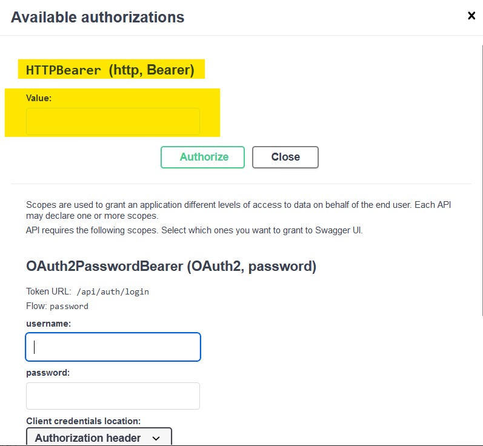
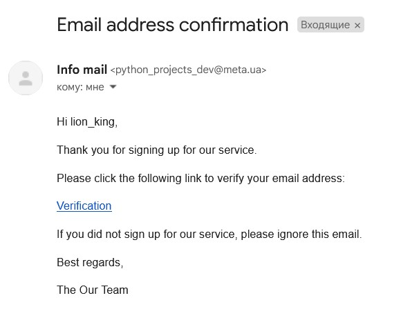
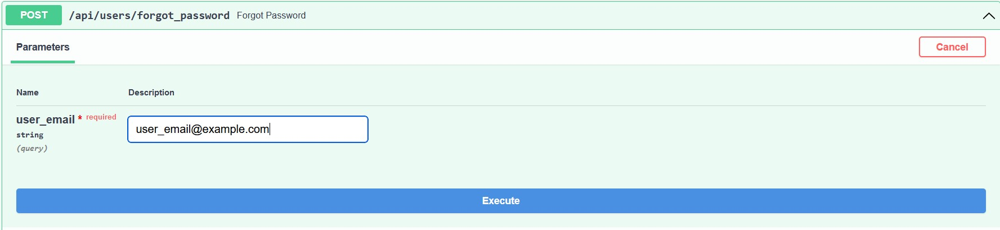
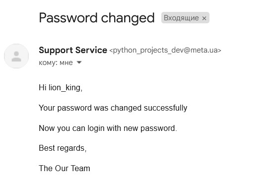
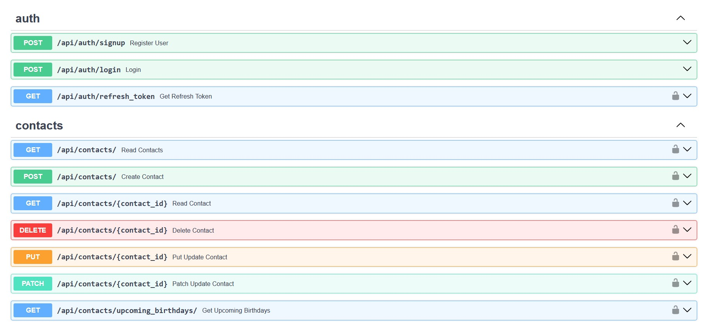
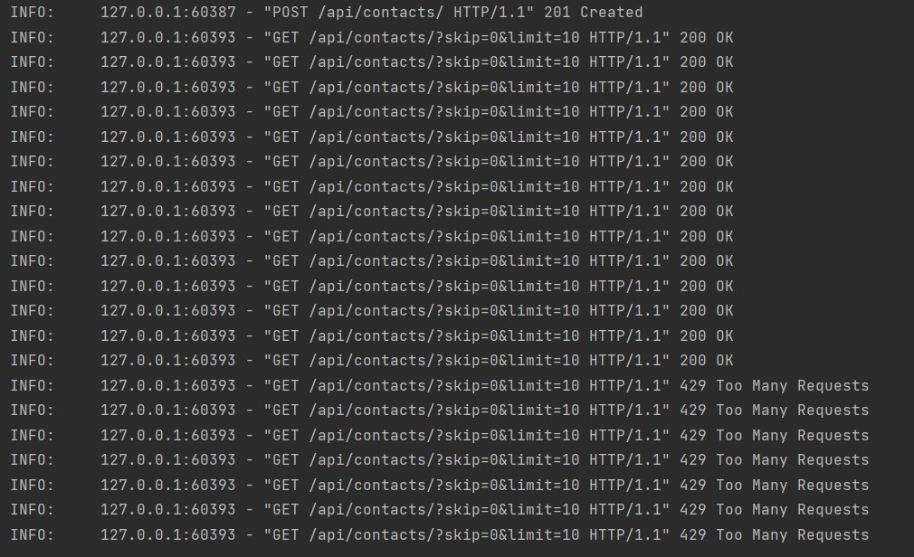
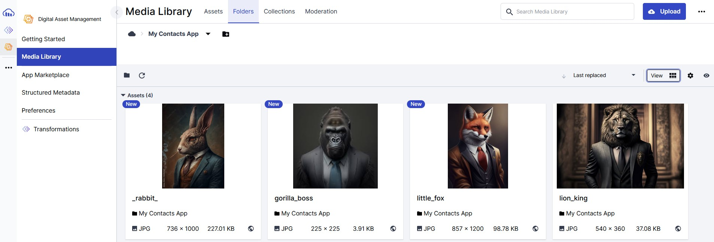

# GoIT_WEB_HW_13_part_1
Individual homework №13 at GoIT school

<div>
  <a href="https://www.python.org" target="_blank">
    
  </a>
  &nbsp;&nbsp;&nbsp;
  <a href="https://fastapi.tiangolo.com" target="_blank">
    
  </a>
  &nbsp;&nbsp;&nbsp;&nbsp;
  <a href="https://www.postgresql.org" target="_blank">
    
  </a>
  &nbsp;&nbsp;&nbsp;&nbsp;
  <a href="https://redis.io" target="_blank">
    
  </a>
  &nbsp;&nbsp;&nbsp;&nbsp;
  <a href="https://www.sqlalchemy.org" target="_blank">
    
  </a>
  &nbsp;&nbsp;&nbsp;&nbsp;
  <a href="https://www.docker.com" target="_blank">
    
  </a>
</div>


## Description

This is a continuation of homework projects [GoIT_WEB_HW_11](https://github.com/S-Stepanov-1/GoIT_WEB_HW_11.git) and [GoIT_WEB_HW_12](https://github.com/S-Stepanov-1/GoIT_WEB_HW_12.git). The project provides a RESTful API for managing your contacts. In this repository, you will find functionalities for creating, retrieving, updating, and deleting contacts, as well as searching for contacts by name, last name, or email address.

In this part, attention was paid to the mechanism of e-mail verification when registering new users. Also now users can change their password in case they forgot their old one. Redis was used to limit the number of requests per time unit, this is one of the mechanisms to protect against excessive load on the server and from automatic collection of information. In addition, the ability to update user avatar via PATCH method was added, avatars are stored in Cloudinary cloud storage. Docker Compose is used to run PostgreSQL and Redis databases.

## Functionalities

Please see the functionality at this link **[GoIT_WEB_HW_12](https://github.com/S-Stepanov-1/GoIT_WEB_HW_12.git)**.

## Running the Project

To run the project on your computer, follow these steps:

1. Clone the repository:
   ```
   git clone https://github.com/S-Stepanov-1/GoIT_WEB_HW_13_part_1.git
   ```

2. Install dependencies:
   ```
   cd GoIT_WEB_HW_13_part_1
   poetry install
   ```

3. Create a `.env` file in the `GoIT_WEB_HW_13_part_1` folder and specify the settings for your PostgreSQL database, secret key and algorithm for JWT tokens,  mail server and Cloudinary account:

### .env
```dotenv
HOST = 127.0.0.1 (for localhost)
POSTGRES_PORT = postgres_port (e.g. 5432)
POSTGRES_USER = your_postgres_user
POSTGRES_NAME = my_contacts (Leave this name for the application to work correctly)
POSTGRES_PASSWORD = your_secret_password_for_DB

SECRET_KEY = your_JWT_key_secret
ALGORITHM = choose_algorithm (e.g. RS256, HS256, HS384 ...)

MAIL_USERNAME = your_mail_address
MAIL_PASSWORD =password_for_email
MAIL_FROM = your_mail_address
MAIL_SERVER = your_mail_server


CLOUDINARY_NAME=
CLOUDINARY_API_KEY=
CLOUDINARY_API_SECRET=
```
All data for Cloudinary you can find in your account.

4. Run a Docker compose with PostgreSQL and Redis:
    ```
    docker-compose up -d
    ```
    You can also use cloud services of PostgreSQL and Redis.

5. Perform migrations to create tables in the database:
   ```
   alembic upgrade heads
   ```

6. Start the server:
   ```
   uvicorn main:app --host localhost --port 8000 --reload  
   ```

You can now access the API by making requests to 
    ```
    http://localhost:8000/docs
    ```
    or
    ```
    http://localhost:8001/redoc
    ```

## Usage

Now the user needs to register. To get access to all routes, user needs to log in, but before that user needs to check email box and confirm the registration.  After logging in user will receive some tokens. Please use `refresh_token` in this field (see screen).


### Field for refresh token



### E-Mail with confirmation



### Forgot password route
If user's forgotten her/his password she/he should use `forgot password` route.
In the form she/he should enter her/his email address after which an e-mail will be sent with a link to the form for entering a new password.




### New password form


Now the password will be updated in the database and the user will be able to use the new password for login. 


### Password changed successufully




## Request Examples

Examples of requests and responses for all the functionalities described above can be found in the [API documentation](http://localhost:8000/docs) after starting the server.
### API



### Server logs - Too many requests
If the user makes more than 15 requests per minute, a "429 Too many requests" status code will be generated.




## Example of storing avatars of registered users on Cloudinary service



## Conclusion

The **GoIT_WEB_HW_13_part_1** project provides a convenient way to manage contacts and their birthdays through a RESTful API. Follow the instructions above to deploy the project on your computer and start using its functionalities. If you have any questions, feel free to reach out to the project author.
